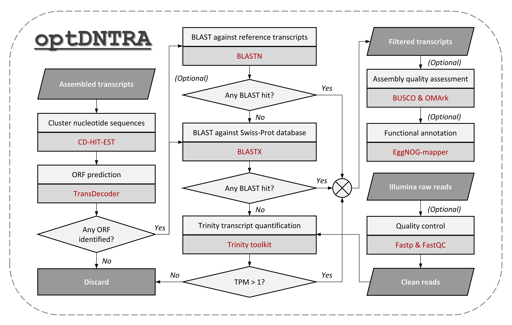

# optDNTRA: Optimization of De Novo Transcriptome RNA-seq Assembly

## Overview

`optDNTRA` is a comprehensive command-line tool designed to optimize transcript assemblies generated by RNA-seq assemblers (e.g., Trinity). It streamlines data processing for both single-end and paired-end RNA-seq datasets and provides extensive quality control and assessment capabilities. The tool is fully integrated with Snakemake, ensuring reproducible and scalable workflows.



## Installation

To install the required dependencies for `optDNTRA`, we recommend using [Mamba](https://github.com/mamba-org/mamba), a fast and robust package manager that serves as a drop-in replacement for Conda. Mamba significantly accelerates the installation process and handles complex dependency resolution more efficiently.

To set up `optDNTRA`, first ensure you have Mamba installed. Then, clone the repository and create an environment as follows:

```bash
git clone https://github.com/zywu2002/optDNTRA.git
cd optDNTRA
mamba env create -f environment.yml
mamba activate optDNTRA
export PATH=/path/to/optDNTRA/directory:$PATH
```

## Usage

> [!NOTE]
> Before running the `optDNTRA` Snakemake pipeline, you need to configure the `defaults.yml` file. This file defines the necessary paths and parameters for the workflow.

Here's a summary of the available command-line arguments:

```
$ python optDNTRA.py -h

usage: optDNTRA.py [-h] -c defaults.yml -t transcripts.fasta [-f reads.fq] [-1 reads_1.fq] [-2 reads_2.fq] [-s samples.tab] [-o optDNTRA_out] [-r reference.fasta] [-se] [-ss {F,R,RF,FR}] [--trim] [--qc] [--buscoAsmt] [--omarkAsmt] [--emapperAnno] [-v] [-p THREADS] [--snakemakeOptions SNAKEMAKEOPTIONS]

optDNTRA: Optimization of De Novo Transcriptome RNA-seq Assembly

For RNA-seq input data:
    If Paired-end:
        -1 <string>, --left <string>         left reads
        -2 <string>, --right <string>        right reads
    Or Single-end:
        -f <string>, --fastq <string>        single-end reads
    Or
        -s <string>, --sampleSheet <string>  tab-delimited text file indicating biological replicate relationships
        Example:
            cond_A    cond_A_rep1    A_rep1_left.fq    A_rep1_right.fq
            cond_A    cond_A_rep2    A_rep2_left.fq    A_rep2_right.fq
            cond_B    cond_B_rep1    B_rep1_left.fq    B_rep1_right.fq
            cond_B    cond_B_rep2    B_rep2_left.fq    B_rep2_right.fq
        For single-end, remove the 4th column in the text file.
        

options:
  -h, --help            show this help message and exit
  -c defaults.yml, --config defaults.yml
                        Path to the workflow configuration file (defaults.yml)
  -t transcripts.fasta, --transcript transcripts.fasta
                        Transcript FASTA file
  -f reads.fq, --fastq reads.fq
                        Single-end reads (FASTQ)
  -1 reads_1.fq, --left reads_1.fq
                        Left reads for paired-end data (FASTQ)
  -2 reads_2.fq, --right reads_2.fq
                        Right reads for paired-end data (FASTQ)
  -s samples.tab, --sampleSheet samples.tab
                        Tab-delimited file indicating biological replicate relationships
  -o optDNTRA_out, --outDir optDNTRA_out
                        Output directory (default: optDNTRA_out)
  -r reference.fasta, --reference reference.fasta
                        Reference transcriptome (FASTA)
  -se, --singleEnd      Specify if the input data is single-end (not paired-end)
  -ss {F,R,RF,FR}, --ss-lib-type {F,R,RF,FR}
                        Strand-specific library type: single ('F' or 'R'), paired ('RF' or 'FR')
  --trim                Enable trimming for input data
  --qc                  Enable quality control for input data
  --buscoAsmt           Enable BUSCO assessment
  --omarkAsmt           Enable OMArk assessment
  --emapperAnno         Enable EggNOG-mapper for functional annotation
  -v, --verbose         Print detailed reports (verbose mode)
  -p THREADS, --threads THREADS
                        Number of threads to use (default: 1)
  --snakemakeOptions SNAKEMAKEOPTIONS
                        Additional options to pass directly to Snakemake, e.g. --snakemakeOptions='--dryrun'

Thank you for using optDNTRA (Optimization of De Novo Transcriptome RNA-seq Assembly)!
```

## Example Command

For a practical usage scenario, consider the following command to run optDNTRA on paired-end reads with trimming and quality control enabled:

```bash
optDNTRA.py --transcript transcripts.fasta --left left_reads.fq --right right_reads.fq --threads 8 --trim --qc
```

## Output

Upon completion, `optDNTRA` generates several output files in the specified directory. The key output files include:

- `$outDir/results/02-optimization/03-transEvidence/transcript.flt.final.fa` - Optimized transcript assemblies with low-quality or redundant sequences removed, providing a refined set of transcripts for downstream analysis.

- `$outDir/results/02-optimization/03-transEvidence/transcript.flt.final.pep` - Protein FASTA file derived from optimized transcript assemblies.

- `$outDir/results/03-assessment/Busco/` (if enabled) - Contains completeness scores of the transcriptome based on Benchmarking Universal Single-Copy Orthologs.

- `$outDir/results/03-assessment/Omark/` (if enabled) - Contains functional assessment results.

- `$outDir/results/04-annotation/transAsm.emapper.annotations` (if enabled) - EggNOG-mapper functional annotations mapped to transcripts.

All output files are organized in a structured results folder, ensuring easy access to quality control metrics, optimized transcripts, and assessment data for further analysis or reporting.
